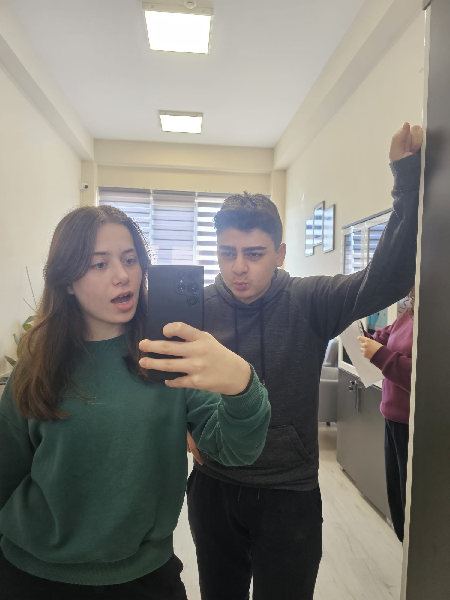
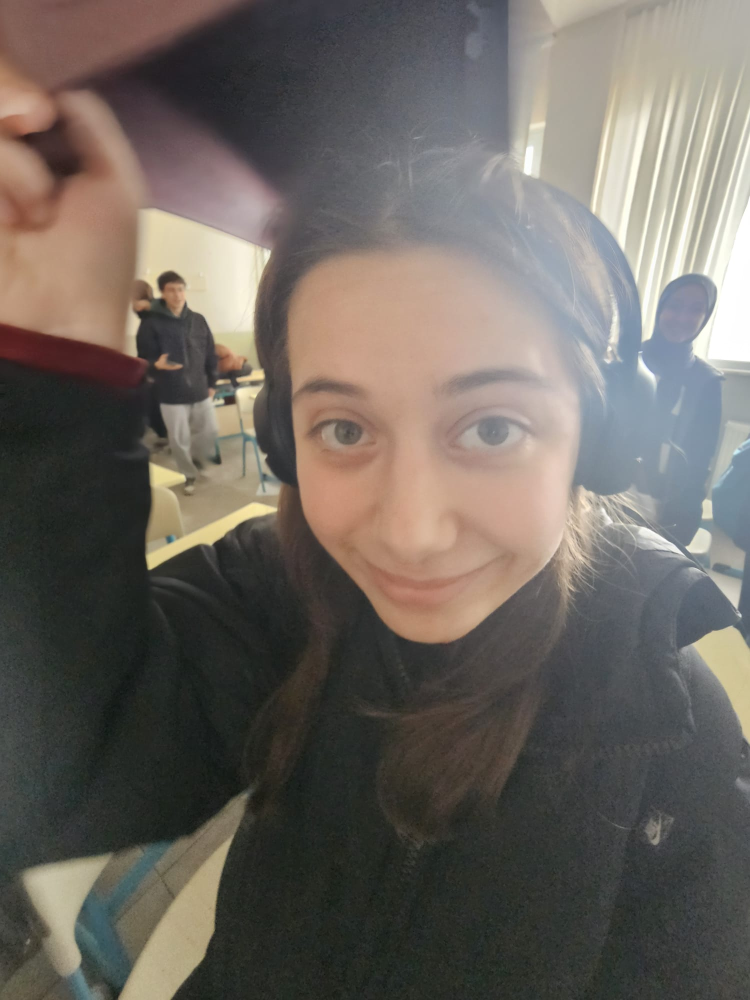

<html lang="tr">
<head>
  <meta charset="UTF-8">
  <title>Mervoş reis kusura bakma😞 al bu pasta sana 🎂</title>
  
</head>
<body>
  <h1>🎂 Mervoş Doğum Günün Kutlu Olsun 🎂</h1>
  
Gurbetteyim gurbettee. İyi ki dogdun iyi ki varsın ❤️🧁🍫🍬🍭🍪🥮🎂 dur pastayı böleyim senin yerine 🍰 heh. Al sana kahve de ☕️. Bir de hediye vereyim 🎁. 🎁--> ⭐️(fenerden çaldım) gün bitmeden yetiştirmem lazım  

  

    
    
    
    
    
    
  

  <!-- Oynatma Tuşu -->
<button onclick="playMusic()">Müziği Başlat</button>
<button onclick="pauseMusic()">Durdur</button>

<!-- Ses Dosyası -->
<audio id="arkamuzik" loop>
  <source src="muzik.mp3" type="audio/mpeg">
  Tarayıcınız audio elementini desteklemiyor.
</audio>

  <footer>Hazırlayan: Oruç ❤️</footer>

  
</body>
</html>
